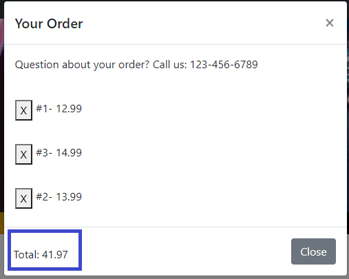

# Ramen Restaurant

<h2> A Ramen restaurant website just for fun. </h2> 

#### Check it out: https://mhvue.github.io/ramenRestaurant 

## Table of Contents
* [How it works](#how-it-works)
    * [Home](#home)
    * [Contact](#contact)
    * [Order](#order)
* [Technologies](#technologies)
* [Inspiration](#inspiration)

## How It Works:

### Home 
Users will first see the About and Why Ramen sections 

There are navigation buttons in the upper left hand.

### Contact 
Need to contact the restaurant? Just clicked Contact button and the contact information pops up. 

### Order
When Order button is clicked, users are directed to page to order off the Menu.

When clicking on Order button, that item number (noted as #) and price will be added to modal. A total is calculated.

An item can be deleted by clicking on X button. The total is updated as well. 

## Technologies 
Project is created with: 
* HTML
* jQuery
* CSS
* Bootstrap

## Inspirtation 
In today's busy world and during quarantine, we are ordering food all the time. I've always been curious on how to create such a websites to see how it works. This was fun to build and I'm continously thinking of to make this website more user-friendly and creative.

